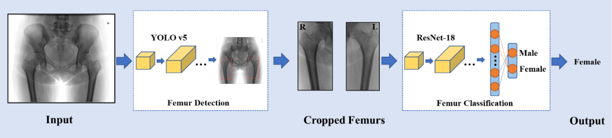

A fully automated sex estimation for proximal femur X-ray images through deep learning detection and classification
===
To develop a fully automated deep learning pipeline using digital radiographs to detect the proximal femur region for accurate automated sex estimation.


Setup
---
### Prerequisites
* Linux or OSX or Windows
* NVIDIA GPU + CUDA CuDNN (CPU mode and CUDA without CuDNN may work with minimal modification, but untested)

### Getting Start
* Check the environment
* Install torch and dependencies
* Clone this repo

```
git clone git@github.com:dicalab-scu/femur-Xray-detection-and-classification.git
```

* Femur detection
```
python detect.py --weights weights/detect.pt --crop True --name test --source femur/images
```

* Femur classification
```
python predict.py --weights weights/predict.pkl --dataset runs/test/crop
```
